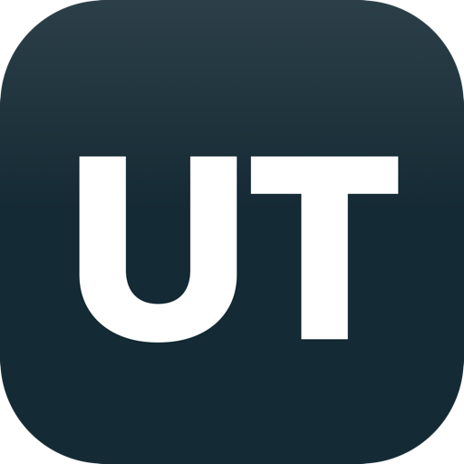
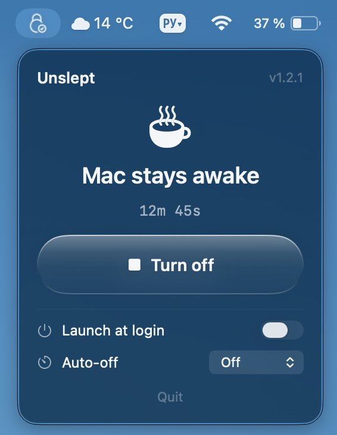

<div align="center">
  
  <h1>Unslept</h1>
  <p><b>Keep your Mac awake while AI writes code — even with the lid closed.</b></p>

  <p>
    <a href="https://github.com/unkidotaplug/Unslept/releases/latest/download/Unslept.dmg"><b>⬇️ Download Unslept.dmg</b></a>
  </p>

  <p>
    
    
    
    
  </p>

  
</div>

---

## What is this

In 2026, long-running AI tasks are the norm: hours-long refactors, generating whole projects, agents that work nonstop. You can't interrupt them — and you can't sit next to your laptop around the clock either. Close the MacBook lid and macOS puts the system to sleep, so the process stalls.

**Unslept** lives in the menu bar and keeps your Mac awake — **even with the lid closed**. Turn it on, walk away, and let the AI finish.

## Features

- 🔒 **Stays awake with the lid closed** — the key difference from `caffeinate` and most alternatives
- 🌙 **Menu bar icon** — the lock toggles between on and off
- ⏱ **Auto-off** — the Mac sleeps on its own after 1 / 2 / 4 / 8 hours
- ⚡ **Launch at login**
- 🪶 **No dependencies** — native Swift, ~600 KB, nothing to install

## Installation

1. **[Download Unslept.dmg](https://github.com/unkidotaplug/Unslept/releases/latest/download/Unslept.dmg)** and open it.
2. Drag **Unslept** into your **Applications** folder (the shortcut is in the same window).
3. First launch: **right-click Unslept → “Open” → “Open”**.
   _The app isn't signed with a paid Apple certificate, so macOS asks for confirmation — only on the first launch._

   If macOS says the app is “damaged”, run this in Terminal:
   ```bash
   xattr -dr com.apple.quarantine /Applications/Unslept.app
   ```
4. A lock icon appears in the menu bar — that's Unslept.

## Usage

| Action | What it does |
|---|---|
| **Turn on** | The Mac won't sleep, including with the lid closed |
| **Turn off** / **Quit** | Restores normal sleep behavior |
| **Auto-off** | Auto-disables on a timer (1–8 hours) |
| **Launch at login** | Starts Unslept when you log in |

> 🔑 On enable and disable, the system asks for your **admin password**. This is required: without admin rights the sleep setting can't be changed, and a closed lid would put the Mac to sleep.

> ⚠️ Always turn off via **Turn off** or **Quit**. If you force-quit the process, the Mac won't sleep until reboot. Emergency reset: `sudo pmset disablesleep 0`.

## How it works

Standard power assertions (`caffeinate -s`, `IOPMAssertion`) only block *idle* sleep. When the lid closes, macOS sleeps **regardless** of them — that's a separate mechanism (clamshell sleep). The only way to keep the system awake with the lid closed and no external display is the system flag `pmset disablesleep 1`, which Unslept sets on enable (with admin rights) and clears on disable.

## Build from source

```bash
git clone https://github.com/unkidotaplug/Unslept.git
cd Unslept
bash build.sh        # compile + assemble the .app (ad-hoc signed)
open build/Unslept.app
bash dist.sh         # (optional) build the .dmg for distribution
```

Requirements: macOS 13+, Xcode Command Line Tools (Swift 6).

## License

Unslept is licensed under the **GNU General Public License v3.0** — see [LICENSE](LICENSE).

You're free to use, study, and modify the code. But any **distributed** derivative work must also be open-sourced under GPLv3 and **retain the original copyright/attribution**. You cannot take this code into a closed-source product.

The name **“Unslept”** and its icon are project branding.

---

<div align="center"><sub>Made for vibe coders · 2026</sub></div>
